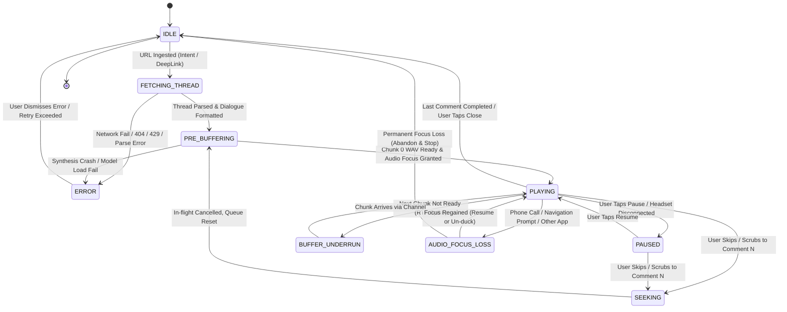

# State Machine & Lifecycle Specification: Redder Playback Engine

## 1. Overview
The Redder audio engine is modeled as a deterministic Finite State Machine (FSM) running inside `RedderAudioService`. It orchestrates network ingestion, dialogue parsing, neural speech inference backpressure, and media playback.

---

## 2. Visual State Diagram



---

## 3. Tabular State Transition & Side-Effect Matrix

| Current State | Trigger / Event | Next State | Side Effects & Guarantees |
| :--- | :--- | :--- | :--- |
| **`IDLE`** | `INGEST_URL(url)` | `FETCHING_THREAD` | Launch network coroutine. Acquire partial wake lock. Show notification with "Resolving thread...". |
| **`FETCHING_THREAD`** | `FETCH_SUCCESS(json)` | `PRE_BUFFERING` | Run tree pruner, sanitization, voice allocator. Populate `List<DialogueChunk>`. Start `PlaybackOrchestrator.startPipeline(startIndex=0)`. |
| **`FETCHING_THREAD`** | `FETCH_FAILURE(err)` | `ERROR` | Exponential backoff retry (up to 3x). If terminal, release wake lock, emit user-facing error message to HUD. |
| **`PRE_BUFFERING`** | `CHUNK_READY(0)` | `PLAYING` | Request `AUDIOFOCUS_GAIN`. Feed Chunk 0 into `ExoPlayer`. Set `playWhenReady = true`. Transition notification to active playback. |
| **`PRE_BUFFERING`** | `SYNTHESIS_ERROR` | `ERROR` | Log inference failure. Release audio resources. |
| **`PLAYING`** | `USER_PAUSE` | `PAUSED` | Call `player.pause()`. Retain buffered chunks in Channel. Producer remains suspended (0% CPU). |
| **`PAUSED`** | `USER_RESUME` | `PLAYING` | Request `AUDIOFOCUS_GAIN`. Call `player.play()`. |
| **`PLAYING`** | `CHANNEL_EMPTY` (Underrun) | `BUFFER_UNDERRUN` | `player.pause()`. Show subtle loading indicator in HUD. Producer continues synthesizing chunk $N$. |
| **`BUFFER_UNDERRUN`** | `CHUNK_ARRIVED` | `PLAYING` | Enqueue WAV into `ExoPlayer` playlist. Call `player.play()`. Dismiss loading indicator. |
| **`PLAYING`** or **`PAUSED`** | `USER_SEEK(targetIndex)` | `SEEKING` | Cancel active `synthesisJob`. Drain `Channel`. Update HUD scrub position. |
| **`SEEKING`** | `RESET_COMPLETE` | `PRE_BUFFERING` | Launch new synthesis job starting at `targetIndex`. Resume buffering pipeline. |
| **`PLAYING`** | `AUDIOFOCUS_LOSS_TRANSIENT_CAN_DUCK` | `AUDIO_FOCUS_LOSS` | Lower ExoPlayer volume by 80% (`volume = 0.2f`). Playback continues muted/ducked. |
| **`PLAYING`** | `AUDIOFOCUS_LOSS_TRANSIENT` | `AUDIO_FOCUS_LOSS` | Pause `ExoPlayer`. Record `resumeOnFocusGain = true`. Retain audio focus request listener. |
| **`AUDIO_FOCUS_LOSS`** | `AUDIOFOCUS_GAIN` | `PLAYING` | Restore volume to 1.0f or resume playback if `resumeOnFocusGain == true`. |
| **`AUDIO_FOCUS_LOSS`** | `AUDIOFOCUS_LOSS` (Permanent) | `IDLE` | Abandon audio focus. Persist current thread and comment index to `SharedPreferences`. Stop foreground service. |
| **`PLAYING`** | `AUDIO_BECOMING_NOISY` (Headset unplugged) | `PAUSED` | Automatically pause `ExoPlayer` immediately to prevent blasting sound through phone speaker. |
| **`PLAYING`** | `THREAD_COMPLETED` (End of comments) | `IDLE` | Play subtle chime. Release wake lock. Stop foreground service after 30s idle timeout. |
| **`ERROR`** | `RETRY` | `FETCHING_THREAD` | Clean state, reset backoff counter, re-execute ingestion. |
| **`ERROR`** | `DISMISS` | `IDLE` | Stop foreground service. Dismiss HUD error banner. |

---

## 4. Timeout Policies, Retry Backoffs, and Cancellation Guarantees

### A. Network Ingestion Timeout & Retry Policy
- **HTTP Connect Timeout**: $5,000\text{ ms}$
- **HTTP Read Timeout**: $8,000\text{ ms}$
- **Redirect Limit**: Maximum 5 hops (prevents circular redirect DOS).
- **Retry Backoff**:
  ```
  Attempt 1: Immediate execution
  Attempt 2: Wait 1,000ms + Jitter (±200ms)
  Attempt 3: Wait 2,500ms + Jitter (±500ms)
  Failure: Transition to ERROR (HTTP_TIMEOUT or RATE_LIMITED_429)
  ```

### B. Synthesis Timeout & Buffer Watchdog
- **Max Synthesis Budget Per Chunk**: $8,000\text{ ms}$
- If an individual dialogue chunk exceeds $8,000\text{ ms}$ of ONNX inference time without returning PCM data (indicating an engine deadlock or pathological input), the watchdog:
  1. Interrupts the current inference step.
  2. Drops the pathological chunk or falls back to system TTS for that single utterance.
  3. Emits a warning log: `"Synthesis timeout on chunk $id, skipping"`.
  4. Continues to the next dialogue chunk without halting the entire thread.

### C. Cooperative Cancellation Guarantees
- Every iteration of the synthesis producer checks Kotlin's coroutine cancellation token:
  ```kotlin
  for (i in startIndex until dialogueList.size) {
      currentCoroutineContext().ensureActive() // Throws CancellationException if cancelled
      val pcm = ttsEngine.synthesizeToPcm(dialogueList[i].formattedText, dialogueList[i].voiceId)
      audioChannel.send(SynthesizedChunk(i, dialogueList[i], pcm))
  }
  ```
- Upon receiving a `SEEK` or `STOP` event, `synthesisJob.cancel()` is invoked. The active coroutine cancels before initiating the next ONNX tensor allocation, guaranteeing zero orphan audio chunks in memory.
